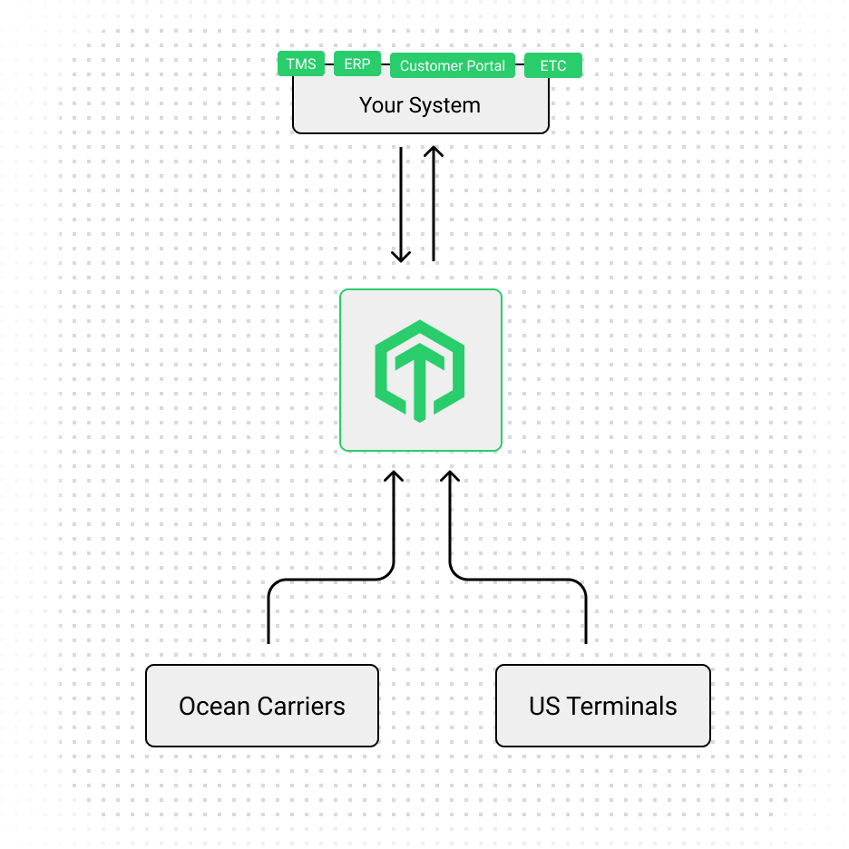

# Overview

The Terminal49 API offers a convenient way to programatically track your shipments from origin to destination.

Here are just a few of the data points we return and possible use-cases. 

Data | Example Use Case
-----|-------------------
 Destination ETA | Surface ETA changes to your relevant teams as they're reported
 Last Free Day and terminal status¹ | Track containers approaching LFD and prioritize dispatching
 Fees and holds at destination terminal | Clear your cargo to keep you containers moving
 Actual departure and arrival times | Report journey times by route to compare your ocean carriers performance

_1.  At container ports in the US_
## How it works
All you need to provide are your BOL numbers and SCACs. Terminal 49 will lookup the shipment with the carrier and populate shipment details including containers. 

Once the shipment is setup Terminal 49 periodically checks with the carrier and the destination terminal. If any of the details of your shipment or containers change (for example - if the ETA changes) we will post the shipment to the the webhook you provide so you are always kept up-to-date.

[CSV of supported US terminals](https://www.terminal49.com/api/docs/../assets/data/Terminal49 Terminal Support.csv)
If you would you like us to support a shipping line or terminals that is not listed above please reach out to us. 

